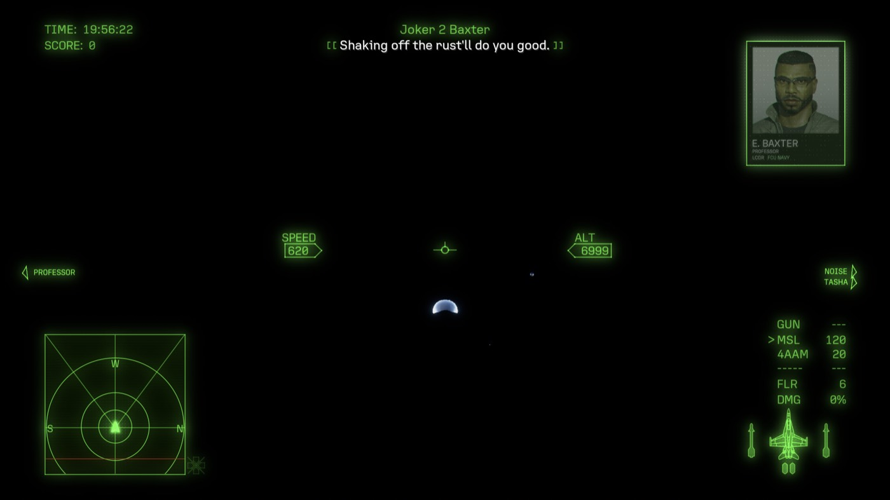
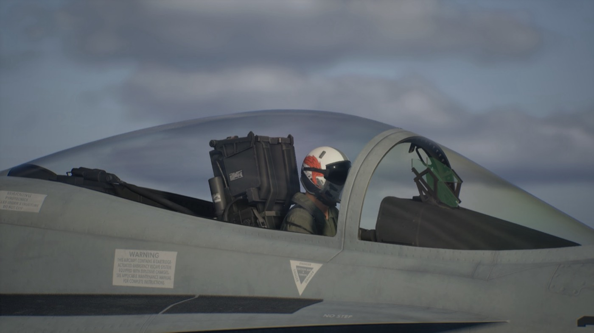

# ACE COMBAT 8 on Mac (CrossOver): black gameplay fix

Unofficial workaround for **ACE COMBAT 8: WINGS OF THEVE** rendering a black world in cutscenes
and missions when run through CrossOver / D3DMetal on Apple silicon. Menus, the hangar viewer and
the character creator work; in flight you only see the HUD and small canopy glints.

| Before | After |
|---|---|
|  |  |

## Status

Works on the one setup it was built on. Please report results for others in the issues.

| | Tested |
|---|---|
| Mac | M5 Pro, macOS 27.0 |
| CrossOver | 26.3 (D3DMetal 3.0) |
| Game | Steam build 25201480 |

Known issue: one freeze followed by the game's "unexpected error (Error 01)" was seen, possibly
triggered by switching to another app during a cutscene. Error 01 is also reported by Windows
players, so it may be unrelated.

## What is wrong

The game's custom sky/cloud renderer has one compute shader, `TraceTilesClassifyCS`, that uses
64-bit floating point because of a single literal in its source:

```hlsl
... > WaveActiveSum(1) * 0.3) ...     // int64 * double
```

Metal has no 64-bit floats, so Apple's shader converter inside D3DMetal rejects the shader
("Unhandled FP64 usage", error 19). That shader feeds the sky and cloud passes, so the sky and all
sun and sky lighting stay at zero. Details and evidence: [docs/ANALYSIS.md](docs/ANALYSIS.md).

## What this does

`build.sh` finds that shader in D3DMetal's cache on your Mac, extracts the source the developer
left embedded in it, changes the line to `float(WaveActiveSum(1u)) * 0.3f`, and recompiles it with
Microsoft's `dxc` using the original compiler arguments. It then builds a small pass-through
library that sits in front of Apple's converter and swaps in the corrected shader when D3DMetal
asks for that one. Every other shader is passed through untouched.

- No game files are modified.
- This repository contains no game code, no Apple code and no Microsoft binaries. Everything is
  produced from your own installation (`dxc` is downloaded from Microsoft's GitHub releases).

## Requirements

- Apple silicon Mac with CrossOver installed in `/Applications`, and the game installed in a bottle
- Xcode Command Line Tools: `xcode-select --install`
- The game launched at least once (to the main menu is enough), so D3DMetal has cached its shaders

## Install

```sh
git clone https://github.com/VanAntonietti/ace-combat-8-crossover-fix.git
cd ace-combat-8-crossover-fix
BOTTLE=Steam ./build.sh      # BOTTLE = the CrossOver bottle the game is in
# quit the game and Steam, then:
./install.sh install
```

The build ends with a self-test that must print:

```
original shader, Apple converter directly: FAILED (code 19)
original shader, through the shim:         compiled (code 0)
```

Start the game. `~/Library/Logs/ac8-d3dmetal-shim.log` gets a
`substituted TraceTilesClassifyCS` line on each launch that used the fix.

## Uninstall

```sh
./install.sh uninstall
```

## Things to know

- **It modifies CrossOver.** Two files are placed in
  `CrossOver.app/.../D3DMetal.framework/Versions/A/Resources/`, and the stock converter is backed
  up in `build/`. While installed, `codesign --verify` on CrossOver.app fails. If macOS ever
  refuses to open CrossOver, run the uninstall, or reinstall CrossOver.
- **CrossOver updates remove it.** Run `./build.sh && ./install.sh install` again afterwards.
- **Game updates may break it.** If the developer changes that shader, the picture goes black
  again; rerun `./build.sh`. If the build says no FP64 shader was found, the game or CrossOver has
  probably fixed the problem and you should uninstall.
- **It affects every D3DMetal game** in the sense that all shaders now pass through the shim, but
  it only acts on this one shader, matched by hash.
- **Use at your own risk.** Not affiliated with Bandai Namco, CodeWeavers, Apple or Microsoft.

## Optional: hide the "AMD graphics driver has known issues" popup

D3DMetal identifies itself as an AMD card with an old driver, and the game warns about it on every
launch. The game deletes a user `Engine.ini` at startup unless the file is locked:

```sh
CFG="$HOME/Library/Application Support/CrossOver/Bottles/Steam/drive_c/users/crossover/AppData/Local/BANDAI NAMCO Entertainment/ACE COMBAT 8/Saved/Config/Windows"
printf '[SystemSettings]\nr.WarnOfBadDrivers=0\n' > "$CFG/Engine.ini" && chflags uchg "$CFG/Engine.ini"
# undo:  chflags nouchg "$CFG/Engine.ini" && rm "$CFG/Engine.ini"
```

## Troubleshooting

- `No D3DMetal shader cache for AceCombat8.exe found`: launch the game once, quit, rebuild.
- Still black after installing: check the log file above. No `substituted` line means the shader
  did not match; rebuild after launching the current game version once.
- To see D3DMetal's own shader errors:
  `/usr/bin/log show --last 10m --predicate 'senderImagePath CONTAINS[c] "D3DMetal"'`.
  About 28 `UnsupportedWaveSize` errors per launch are normal and harmless.

## License

MIT for the code in this repository. See [LICENSE](LICENSE).
